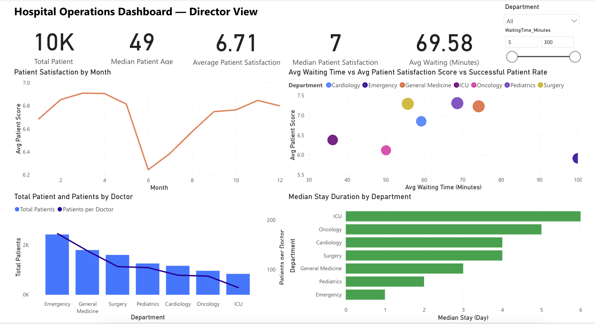
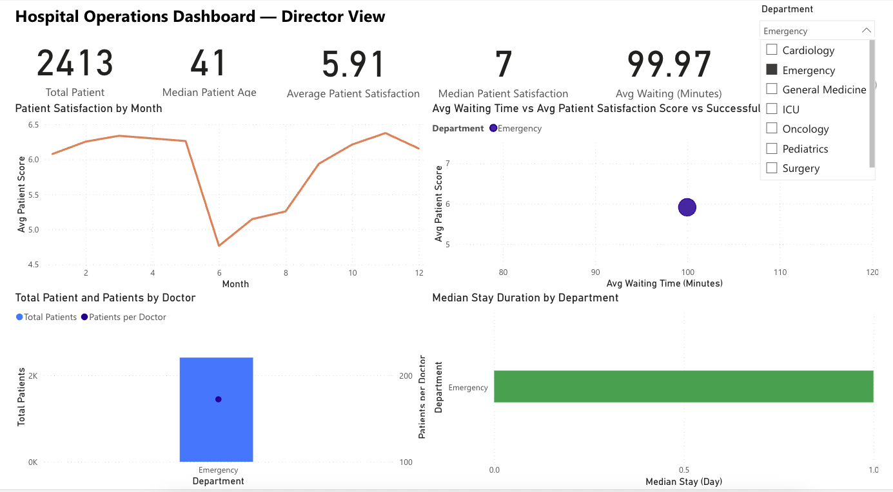
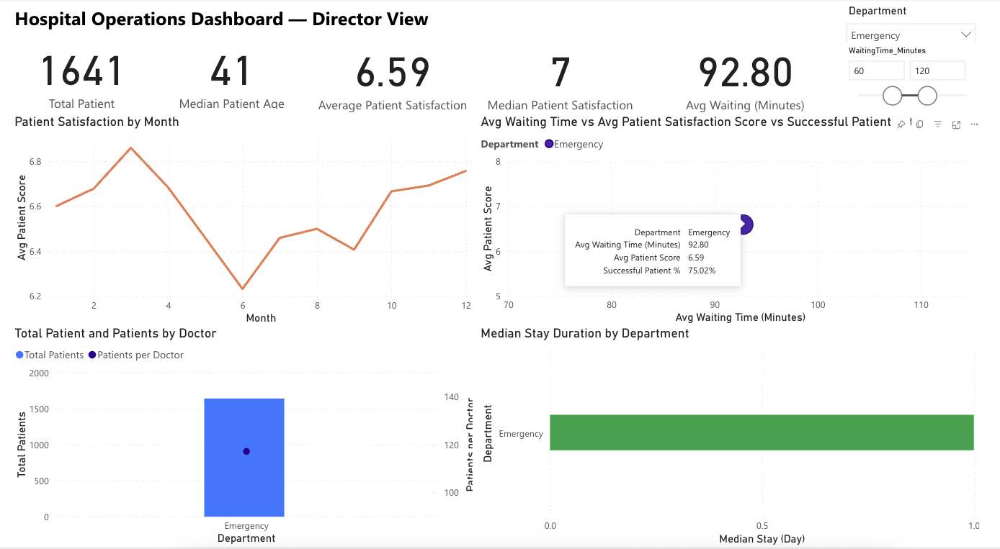

# Hospital Operations Power BI Dashboard — Director View

An interactive Power BI dashboard analysing hospital operational performance across seven departments, built to support director level decision making. Developed as part of my Master of Business Analytics at Deakin University.

> **Note:** All data used in this project is synthetic / anonymised. No real patient or hospital information is included.

---

## 🔗 View the Interactive Dashboard

**[Open the live interactive report →] https://app.powerbi.com/links/88FJ7VY5rV?ctid=d02378ec-1688-46d5-8540-1c28b5f470f6&pbi_source=linkShare**

The live version supports full interactivity, department slicers, waiting time range filters, and cross filtering across all visuals. No login or software required; it opens directly in your browser.

**[Download the .pbix file](./Hospital_Director_report.pbix)** and open it in Power BI Desktop to explore the data model, relationships, and DAX measures.

---

## 📸 Dashboard Preview

*Executive overview: KPI summary, departmental patient load, service quality, and length of stay analysis, all connected through interactive slicers.*

Interactive Filtering
The report responds to a Department slicer and a Waiting Time range filter. Selecting a department instantly updates every visual on the page, letting the viewer drill into a single service line.

Example: filtering to the Emergency department. All KPIs and visuals update in sync to show that department's patient volume, satisfaction, waiting time, and length of stay.

---

## 📊 What the Dashboard Shows

The report brings together four complementary views of hospital performance on a single page:

- **KPI summary** — total patients, median patient age, average and median patient satisfaction, and average waiting time, giving an at a glance operational snapshot.
- **Resource load** — total patients and patients per doctor by department, highlighting where the workload concentrates.
- **Service quality** — a three dimensional view of average waiting time, patient satisfaction, and successful patient percentage by department.
- **Length of stay** — median length of stay per department, using the median to avoid distortion from extreme long stay cases.
- **Satisfaction trend** — patient satisfaction across the year to surface seasonal or temporal patterns.

An interactive **Department slicer** and **Waiting Time range filter** let the viewer drill into any segment, with all visuals updating in sync.

---

## 🛠️ Tools & Techniques

- **Power BI Desktop** — data modelling, visual design, report building
- **DAX** — custom measures including median length of stay, average patient satisfaction, and successful patient percentage
- **Power Query** — data cleaning and transformation
- **Interactive design** — slicers, cross filtering, and custom tooltips for exploratory analysis
- **Power BI Service** — published and shared via Publish to web

---

## 💡 Key Insights

- Patient satisfaction tends to decline as average waiting time increases, though the relationship varies by department.
- Emergency carries a high patient load with a comparatively lower patients per doctor ratio, pointing to a potential resourcing pressure point.
- Length of stay differs meaningfully across departments (ICU and Oncology sit at the higher end), which has implications for bed turnover and cost.

---

## 📁 Repository Contents

| File | Description |
|------|-------------|
| `Hospital_Director_repor.pbix` | Source Power BI file — open in Power BI Desktop to inspect the model and DAX |
| `screenshots/` | Dashboard preview images |
| `README.md` | This file |

---

## 👤 About

Built by **Danny Chen**, Master of Business Analytics candidate at Deakin University (graduating 2027 T1), as a portfolio piece demonstrating end-to-end BI development — from data preparation through to an interactive, decision-focused dashboard.

📍 Melbourne, VIC
